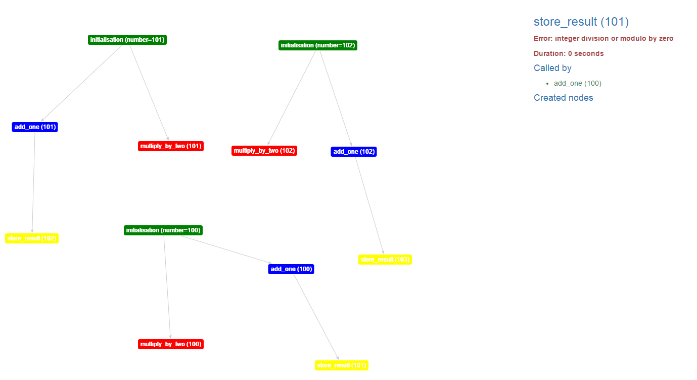
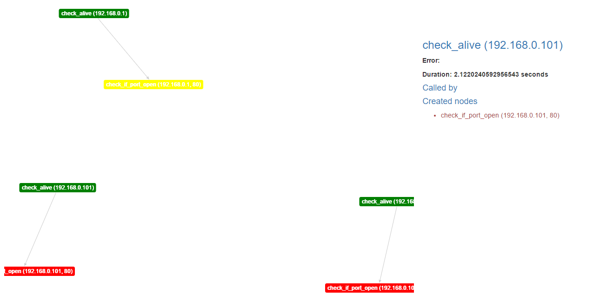

Basic usage
===========

Next I will show how you can use this module and what you can accomplish with it.

Minimal example
---------------

Firstly, a minimal example is the following::

    from taswor import Workflow, node, Next

    start_args = [
        ((), {"number": 100}),
        ((), {"number": 101}),
        ((), {"number": 102}),
    ]

    @node(start=True, init_args=start_args)
    def initialisation(number):
        print(number)
        return [
            Next("add_one", number),
            Next("multiply_by_two", number)
        ]

    @node()
    def add_one(number):
        return Next("store_result", number + 1)

    @node()
    def divide_by_zero(number):
        number = number // 0

    @node()
    def store_result(*args, **kwargs):
        print(args, kwargs)

    if __name__ == '__main__':
        workflow = Workflow(
            initialisation.node, add_one.node, divide_by_zero.node, store_result.node
        )
        workflow.start()
        workflow.wait_for_completion()
        workflow.dump_result_as_html("test")
        workflow.close()

After we run the script, we will obtain a ``test`` directory in the current working directory with a ``index.html`` file.
The ``index.html`` file will contain a visualisation of the workflow:

The green nodes represent the starting nodes, the blue nodes represent the intermediary nodes that were processed
with success, the yellow nodes represent nodes that did not return anything (leaf nodes) and red nodes represent
nodes that raised an exception. When clicking a certain node, in the right panel will be displayed information about
the node processing.

Real-life example
-----------------

Let's assume we have a cluster of servers and we want to check if they have a running HTTP server on port 80::

    import os
    import urllib.request
    from taswor.workflow import Workflow, node
    from taswor.util import Next

    machines = [
        (("192.168.0.1",), {}),
        (("192.168.0.100",), {}),
        (("192.168.0.101",), {})
    ]

    @node(start=True, init_args=machines)
    def check_alive(ip):
        status = os.system("ping -n 1 {}".format(ip))
        if status != 0:
            raise ConnectionRefusedError("Unable to ping machine {}".format(ip))
        return Next("check_if_port_open", ip, 80)

    @node()
    def check_if_port_open(host, port):
        try:
            urllib.request.urlopen("http://{}:{}".format(host, port))
        except urllib.request.HTTPError:
            return

    if __name__ == '__main__':
        workflow = Workflow(check_alive.node, check_if_port_open.node)
        workflow.start()
        workflow.wait_for_completion()
        workflow.dump_result_as_html("result")
        workflow.close()

This code will produce:

.. note::
    Complex workflows with many nodes will produce graphs that will be harder to comprehend and understand.