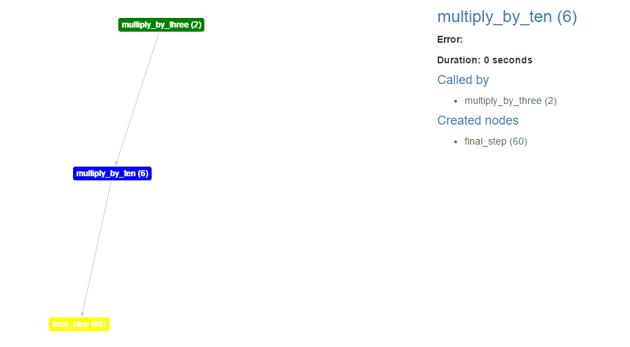

Introduction
============

Description
-----------

**Taswor** comes from **Task Workflow** and is a tool for building a workflow of tasks with support for visualising
the execution flow. More precise, you define some nodes (functions) whose results reference other nodes in order to
create the application logic, define an entry point and then run the workflow. After finish, you can visualize what
happened in a html-based view where you can see what called what and what happened in each step.

Features
--------

- Caches (node execution can be cached in order to save time)
- Data store (nodes can store values in a global space shared between the workers) (**TO DO**)

Simple usage
------------

This is a basic example of workflow that computes ``(2 + 3) * 7`` in a distributed manner::

    from taswor import Workflow, node, Next

    @node(start=True, init_args=[((2,), {})])
    def multiply_by_three(a):
        return Next("multiply_by_ten", a * 3)

    @node()
    def multiply_by_ten(a):
        return Next("final_step", a * 10)

    @node()
    def final_step(a):
        print(a)

    if __name__ == '__main__':
        workflow = Workflow(
            multiply_by_three.node, multiply_by_ten.node, final_step.node
        )
        workflow.start(wait=True)
        workflow.dump_result_as_html("results")
        workflow.close()

After we run the snippet, we will obtain in the current working directory the directory ``results`` which contains
``index.html`` with the content

